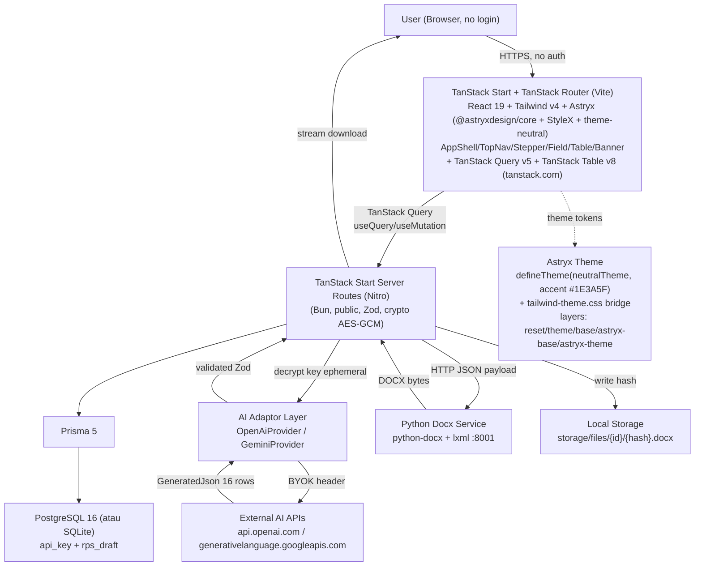
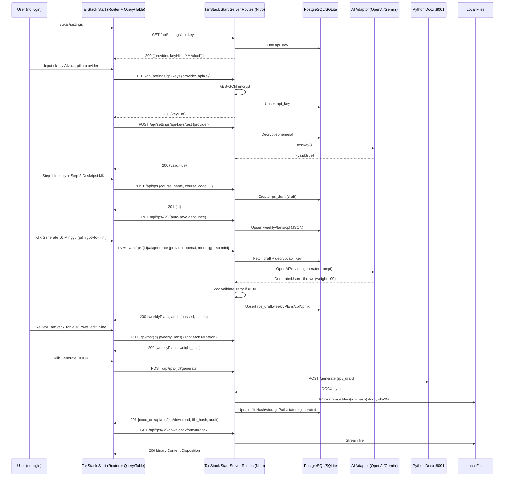

# ARCHITECTURE.md: RPS OBE Generator — Simple BYOK + Full Astryx + TanStack

## System Overview

RPS OBE Generator Simple adalah **Bun 1.1+ + React 19 + TanStack Start + TanStack Router + Tailwind v4 + Full Astryx Design System (@astryxdesign/core + @stylexjs/stylex + @astryxdesign/theme-neutral + @astryxdesign/cli) + TanStack Query/Table + Prisma/PostgreSQL (atau SQLite) + Python python-docx microservice** tanpa login, tanpa Redis, tanpa S3. Arsitektur adalah **TanStack Start monolith ringan** (Vite + Nitro) dijalankan via **Bun**: TanStack Router file-based routing melayani UI SPA full Astryx (AppShell/Stepper/Field/Table/Banner via StyleX) dan TanStack Start server routes; adaptor AI multi-provider (OpenAI + Gemini) dipanggil server-side dengan BYOK decrypt ephemeral; Python service tetap terisolasi untuk fidelity DOCX identik (`w:sectPr` 6, `w:tblGrid`, `sz=18`). Tanpa Node.js, tanpa Next.js. Persistensi hanya 2 tabel (`api_key`, `rps_draft`) dengan file local. Theme via `defineTheme({extends: neutralTheme, color:{accent:['#1E3A5F']}})` + Tailwind v4 bridging (`tailwind-theme.css`). Runtime **Bun** (kompatibel `node:crypto`/`node:fs`). Lihat `https://tanstack.com`.

## High-Level Architecture Diagram



Tidak ada `Auth Middleware`, `Redis+BullMQ`, `S3`, `LibreOffice queue` wajib, atau `Nginx rate-limit login`.

## Component Breakdown

### TanStack Start Frontend — React 19 + TanStack Router + Tailwind v4 + Full Astryx + TanStack (tanstack.com)

- **Routing:** **TanStack Router** file-based routes (Vite): `src/routes/index.tsx` (`/`), `src/routes/rps.$id.tsx` (`/rps/$id`), `src/routes/settings.tsx`. Gantikan Next.js App Router; navigasi via `createRouter` + `Link`. Shell via Astryx `AppShell` + `TopNav` (header minimal) dengan React 19.
- **Pages (Astryx):** `/` (Astryx `Card`/`ClickableCard` + `Pagination` list draft + `EmptyState` + search/Create), `/rps/$id` (Astryx `Stepper`/`Step` 3 langkah: Identity → Deskripsi → AI Generate + Review `Table` + `Banner`/`Badge`/`ProgressBar` audit), `/settings` (Astryx `Card` + `Field`/`TextInput` BYOK per provider + `Dialog`/`Toast`).
- **Astryx install & theme:** `bun add @astryxdesign/core @stylexjs/stylex @astryxdesign/theme-neutral @astryxdesign/cli` + `bunx astryx init --all` scaffolds `tailwind-theme.css` bridge + `lib/theme.ts` via `defineTheme({ extends: neutralTheme, color:{accent:['#1E3A5F','#234876']}})`. `globals.css` layer order `@layer reset, theme, base, astryx-base, astryx-theme, components, utilities` (lihat DESIGN_SYSTEM.md). StyleX compiler aktif hanya jika `astryx swizzle`/`xstyle` dipakai.
- **TanStack Query v5:** Server state untuk `["api-keys"]`, `["rps"]`, `["rps", id]`, `["rps", id, "ai-generate"]`. Caching 30s, retry 1, invalidasi on mutation (`PUT /api/rps/{id}`, `POST /ai/generate`, `PUT /api/settings/api-keys`). Optimistic update untuk inline cell edit (cell `TextInput` Astryx).
- **TanStack Table v8 dibungkus Astryx `Table`:** `Table` Astryx adalah wrapper TanStack Table headless. Kolom: `week` (display `1`/`2`/`3, 4`/…/`16`, `Badge` merged), `material`/`method`/`experience`/`assessmentCriteria`/`weight`/`is_merged`. Fitur: inline edit via Astryx `TextInput`/`Selector` di cell `meta.updateData`, sorting by week, row pin UTS/UAS merged, live footer `Σ weight` via `Badge variant:success/danger + ProgressBar` + `Banner status:error/warning/info` audit.
- **No Auth:** Tidak ada JWT, guard hanya client-side redirect `/settings` opsional (selalu allow).

### TanStack Start Server Routes (Nitro, Bun)

- **Responsibilities:** CRUD `rps_draft`, `api_key` encrypt/decrypt, AI adaptor orchestration, audit (weight 100, 16 rows, merged, typo scan), DOCX proxy ke Python, file streaming.
- **Validation:** Zod schemas per endpoint; `sks_total = sks_theory + sks_practice`, taxonomy {A2,P3,C2,C3,C4}, weight sum 100.
- **Crypto:** `crypto.createCipheriv('aes-256-gcm')` dengan `APP_ENCRYPTION_KEY` 32-byte hex; `encrypt(key)` → `iv:authTag:ciphertext` base64; `decrypt` hanya di `test` dan `ai/generate`.
- **Audit Engine:** Pure TypeScript: sum weights, count 16, check `is_merged` week 8/16, typo scan (`paian`, `Sbu-CPMK-5`, dll), placeholder scan.

### AI Adaptor Layer (Multi-Provider)

- **Interface:**
  ```ts
  type AiProviderName = "openai" | "gemini";
  interface AiProvider {
    testKey(key: string): Promise<{ valid: boolean; models?: string[] }>;
    generate(key: string, prompt: RpsPrompt, model: string): Promise<GeneratedJson>;
  }
  class OpenAiProvider implements AiProvider // POST https://api.openai.com/v1/chat/completions, response_format json_object
  class GeminiProvider implements AiProvider // POST https://generativelanguage.googleapis.com/v1beta/models/{model}:generateContent, responseMimeType application/json
  ```
- **Prompt Canonical:** System: "Kamu generator RPS OBE... Output JSON ketat: {cpl:[2], cpmk:[4], subCpmk:[7], weeklyPlans:[9]{week:"1"|"2"|"3, 4"|"5,6,7"|"8"|"9,10,11"|"12,13"|"14,15"|"16", material, method, experience, assessmentCriteria, weight:5|10|20|30, isMerged}, rtmTasks:[1 Mind Map 4x50' 5%], rubrics:{observation:[8], assessment:[6]}, bahanKajian:[~20]}" — few-shot IW21ASK1541 variabel `R35 1:5 R36 2:5 R37 3,4:10 R38 5,6,7:20 R39 8:UTS merge R40 9,10,11:30 R41 12,13:10 R42 14,15:20 R43 16:UAS merge =100` + hook `Menyesuaikan pandemic COVID-19`, method `TM 1×(4×50")`/`TM 1×(2×50") + BM+PT`, kop hardcode Megarezky.
- **Normalisasi:** Kedua provider di-map ke `GeneratedJson` yang sama; Zod validasi + retry 1× jika `weight≠100` dengan prompt repair.

### Python Docx Service (python-docx + lxml)

- **Contract:** `POST /generate` accept JSON `{ rps_draft }` (kop `Universitas Megarezky | Fakultas Keperawatan dan Kebidanan | Program Studi S1 Keperawatan dan Pendidikan Profesi Ners` hardcode di service, bukan `global_settings`; course_code canonical `IW21ASK1541` sync cover+R03; SKS `T=3 P=1 total 4`; weekly 9 rows variabel mewakili 16 minggu) → return DOCX bytes dengan 6 `w:sectPr` (portrait cover 12240×15840, landscape weekly/RTM 16840×11907 orient=landscape `w:pgSz 16840x11907`, portrait rubrics 11907×16840), 4 logical `w:tbl` (44×13 main `26 gridCol`, 25×7 RTM `7 gridCol`, 11×4 `32×100` observasi, 8×4 assessment), `w:gridCol`, `w:trHeight atLeast`, `Times New Roman sz=18/szCs=18 (9pt)`, merged UTS/UAS `gridSpan`/`vMerge` label `UJIAN MID/FINAL SEMESTER`, borders `single 4` shading `FFFFFF`, Daring/Luring + pandemic hook.
- **Reuse:** `skills/rps/scripts/rps-generate.py`; `rps-analyze.py` untuk manifest reference; `rps-audit.py` untuk verifikasi post-generate (opsional).
- **Isolation:** PM2 `http://localhost:8001`, health `GET /health`.

### Prisma + PostgreSQL (atau SQLite)

- **Schema:** `DATABASE.md` — hanya `ApiKey` dan `RpsDraft` dengan JSON columns.
- **Migrasi:** `prisma migrate deploy` (Postgres) atau `prisma db push` (SQLite). Seed minimal 1 contoh draft.

### Local Storage (Tanpa S3)

- **Path:** `storage/files/{rpsId}/{hash}.docx` (gitignore). Tidak ada signed URL; stream via `GET /api/rps/{id}/download`.
- **Cache:** Hash by payload JSON; reuse jika hash sama tanpa re-generate.

## Critical Flow Sequence Diagrams

### Setup Key → Input Minimal → AI Generate → Review → DOCX



## Deployment Strategy

### VPS Ringan (Ubuntu 22.04, 1–2GB RAM, 1 vCPU, 20GB SSD)

- **Nginx:** Reverse proxy `/` → TanStack Start 3000 (Vite/Nitro build `.output`), `/api` → same process, `/docx` internal only. HTTPS Let's Encrypt.
- **Bun:** PM2 single instance `rps-web` (TanStack Start `bun .output/server/index.mjs` port 3000). Tidak ada cluster 2.
- **Python:** PM2 `rps-docx` port 8001 (1 instance).
- **DB:** Postgres local atau SQLite file; tanpa Redis.
- **Storage:** Local `/var/www/rps-obe/storage` (chmod 775).
- **TanStack:** Build-time only — tidak ada infra tambahan.

### DNS & SSL

- A record ke VPS IP; `certbot --nginx -d rps.example.com`.

### Monitoring & Logging

- **Logs:** `storage/logs/app.log` + Winston (redact `apiKey`).
- **Health:** `GET /api/health` (DB ok) + `GET http://localhost:8001/health`.
- **TanStack DevTools:** ` TanStack Query Devtools` hanya dev.

## Data Flow Architecture

### AI Generation Path

1. FE `useMutation` POST `/ai/generate` dengan `provider/model`.
2. API decrypt key dari `api_key`, pilih adaptor, build prompt canonical + draft hint.
3. Adaptor fetch provider API (BYOK header), parse JSON, normalize.
4. Zod validate; retry 1× jika `weight≠100`.
5. Upsert `rps_draft` JSON, return + audit issues (typo scan).
6. FE invalidasi `["rps", id]` → TanStack Table re-render 16 rows.

### DOCX Path

1. FE POST `/generate` (TanStack Mutation).
2. API fetch `rps_draft` full, POST ke Python :8001.
3. Python build DOCX (sectPr, tblGrid, merges, sz=18), return bytes.
4. API tulis local, hash, update `rps_draft`, return `docx_url`.
5. FE `GET /download` stream file.

### Audit Path

1. On save atau `POST /ai/generate` atau `POST /generate`, API jalankan audit in-process (weight 100, 16 rows, merged, hierarchy) + typo scan.
2. Return `{ passed, issues: [{code, severity: critical|warning, message, field}] }`; blok DOCX jika critical.

## Security Architecture

### BYOK + Enkripsi (Tanpa JWT)

- **No Auth:** Semua route public; tidak ada `Authorization: Bearer`.
- **Key Storage:** AES-256-GCM dengan `APP_ENCRYPTION_KEY` 32-byte hex; `keyHint` untuk UI; GET tidak pernah plaintext.
- **Ephemeral Decrypt:** Hanya di `test` dan `ai/generate`; tidak cache plaintext; tidak log.
- **Rate Limit:** Opsional in-memory 20/menit per IP untuk `/generate` dan `/ai/generate`.

### Data Protection

- **HTTPS:** HSTS, redirect 80→443.
- **Validation:** Zod di semua input; file DOCX magic bytes + ≤10MB jika upload (opsional).
- **XSS:** React escape; DOCX content sanitize.
- **SQL Injection:** Prisma parameterized.

### TanStack Security

- Query keys tidak mengandung plaintext key; `api-keys` query hanya mask.

## Performance Optimization

### TanStack Query

- **Caching:** `staleTime 30s` untuk `["rps"]` list, `gcTime 5m`.
- **Optimistic Update:** Inline cell edit update `["rps", id]` cache sebelum `PUT` success; rollback on error.
- **Dedup:** `retry: 1` untuk AI generate; `refetchOnWindowFocus: false`.

### TanStack Table

- **Memo:** `useReactTable` dengan `getCoreRowModel`, `getSortedRowModel`; `columnHelper` memoized; 16 rows tidak butuh pagination/virtualization.
- **Debounce:** Weight live calc 300ms; cell commit on blur.

### DB Optimization

- **Single Query:** `findUnique` full JSON; tanpa `include` N+1.
- **Index:** `course_code`, `updated_at`.

### Frontend Optimization

- **Code Split:** Route-based (TanStack Router lazy routes); lazy `Table` untuk `/rps/$id`.
- **TanStack Start:** Vite code-splitting + Nitro prerender `output: .output` untuk VPS ringan.

## Scalability Considerations

- **Single-tenant MVP:** Tidak perlu horizontal; 1 PM2 instance cukup untuk demo.
- **Scale Next:** Jika butuh multi-user anonim, tambah `client_id` cookie + `@@unique([clientId, provider])` + row-level filter.
- **No Queue:** AI dan DOCX sync (<15s + <3s); tanpa BullMQ.

## Development & Build Pipeline

### Local Development

- **Prisma:** `bunx prisma migrate dev` (Postgres) atau `bunx prisma db push` (SQLite), `bunx prisma generate`.
- **Python:** `pip install python-docx lxml fastapi uvicorn`, `uvicorn app:app --port 8001 --reload`.
- **TanStack Start:** `bun run dev` (Vite HMR, TanStack Router + Query Devtools enabled).
- **Env:** `DATABASE_URL`, `APP_ENCRYPTION_KEY` (generate `openssl rand -hex 32`), `DOCX_SERVICE_URL`.

### Production Build

- **TanStack Start:** `bun run build` → `.output` (Nitro) via Vite; `bun .output/server/index.mjs`.
- **Python:** PM2 `ecosystem.config.js` (2 apps: web, docx).

### Deployment

- **GitHub Actions:** On `main` push → SSH VPS: `git pull`, `bun install`, `bunx prisma migrate deploy`, `bun run build` (Vite), `pm2 reload`.

**Document Version:** 2.0-simple
**Last Updated:** 2026-09-10
**Status:** Ready for Development (Full Astryx + TanStack)
