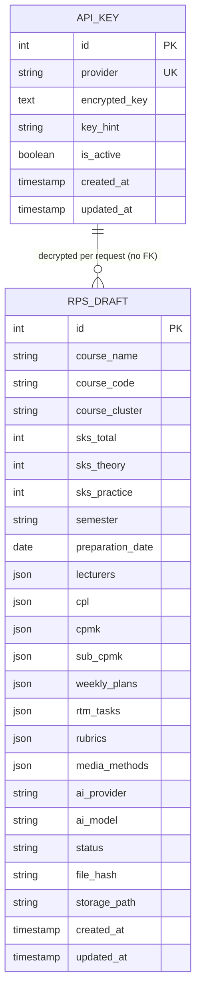

# DATABASE.md: RPS OBE Generator — Full Astryx + TanStack

## Entity Relationship Diagram



Hanya 2 tabel. Semua relasi anak RPS (CPL/CPMK/Sub-CPMK/weekly/RTM/rubric) di-collapse menjadi kolom JSON di `rps_draft` untuk menghindari 7 tabel + join. Tidak ada `USER`, `FACULTY`, `STUDY_PROGRAM`, `TEMPLATE`, `RPS_VERSION`, `RPS_FILE`, `GLOBAL_SETTING`, `ACTIVITY_LOG`.

Single-tenant global: tanpa `owner_id` atau `client_id`. Semua draft dan key shared (cocok untuk demo skripsi pribadi). Follow-up isolasi: tambah `client_id VARCHAR(36)` + cookie `rps_client` httpOnly jika butuh multi-tenant anonim.

## Table Definitions

### API_KEY
Menyimpan API Key BYOK per provider terenkripsi at-rest.

| Column | Type | Constraints | Description |
|:---|:---|:---|:---|
| id | SERIAL | PK | Unique identifier |
| provider | VARCHAR(20) | UK, NOT NULL, CHECK (openai|gemini|claude) | Provider name |
| encrypted_key | TEXT | NOT NULL | AES-256-GCM ciphertext (iv:authTag:ciphertext base64) |
| key_hint | VARCHAR(10) | NULLABLE | Last 4 chars, e.g. `****abcd` untuk mask UI |
| is_active | BOOLEAN | DEFAULT true | Active flag |
| created_at | TIMESTAMPTZ | DEFAULT NOW() | Creation time |
| updated_at | TIMESTAMPTZ | DEFAULT NOW() | Update time |

Enkripsi: `APP_ENCRYPTION_KEY` 32-byte hex di `.env`. Bun `crypto.createCipheriv('aes-256-gcm')` (Node-compatible via `node:crypto`) dengan 12-byte IV random per encrypt; store `iv:authTag:ciphertext` base64. Decrypt ephemeral per request di `POST /api/settings/api-keys/test` dan `POST /api/rps/{id}/ai/generate`; tidak pernah log plaintext. `GET /api/settings/api-keys` hanya return `key_hint`.

### RPS_DRAFT
Draft RPS — satu baris per dokumen. Semua blok kurikulum disimpan sebagai JSON.

| Column | Type | Constraints | Description |
|:---|:---|:---|:---|
| id | SERIAL | PK | Unique identifier |
| course_name | VARCHAR(255) | NOT NULL | Nama mata kuliah |
| course_code | VARCHAR(50) | NOT NULL | Kode canonical `IW21ASK1541` (sync cover+R03, bukan IW25ASK105431/17505R0203) |
| course_cluster | VARCHAR(100) | NULLABLE | Rumpun, e.g. Keperawatan |
| sks_total | INT | NOT NULL | Total SKS |
| sks_theory | INT | NOT NULL | SKS teori |
| sks_practice | INT | NOT NULL | SKS praktik |
| semester | VARCHAR(50) | NOT NULL | e.g. V Ganjil |
| preparation_date | DATE | NOT NULL | Tanggal penyusunan |
| lecturers | JSONB | NOT NULL, DEFAULT '[]' | `[{name, nidn, role: pengembang|koordinator_mk|ketua_prodi|anggota}]` — 3 slot Otorisasi R04-R05 + R29 Dosen Pengampu; require 1 koordinator_mk; kop Univ Megarezky hardcode (tanpa kolom DB) |
| cpl | JSONB | NOT NULL, DEFAULT '[]' | `[{code, description}]` — CONTOH 2 CPL |
| cpmk | JSONB | NOT NULL, DEFAULT '[]' | `[{code, description, taxonomy, cpl_code}]` — CONTOH 4 CPMK |
| sub_cpmk | JSONB | NOT NULL, DEFAULT '[]' | `[{code, description, taxonomy, cpmk_code}]` — CONTOH 7 Sub-CPMK |
| weekly_plans | JSONB | NOT NULL, DEFAULT '[]' | 9 rows render mewakili 16 minggu variabel `[{week:"1"|"2"|"3, 4"|"5,6,7"|"8"|"9,10,11"|"12,13"|"14,15"|"16", weight:5|10|20|30, is_merged for 8/16 label UJIAN MID/FINAL SEMESTER}]` sum 100 |
| rtm_tasks | JSONB | NULLABLE | `[{task_no, description, duration, weight, cpmk_code}]` |
| rubrics | JSONB | NULLABLE | `{ observation: [{criterion, indicator, weight}], assessment: [...] }` |
| media_methods | JSONB | NOT NULL, DEFAULT '[]' | `["Vercel", "REST API"]` |
| ai_provider | VARCHAR(20) | NULLABLE | Provider yg dipakai generate: openai|gemini |
| ai_model | VARCHAR(50) | NULLABLE | Model, e.g. gpt-4o-mini |
| status | VARCHAR(20) | NOT NULL, DEFAULT 'draft', CHECK (draft|generated) | Workflow status |
| file_hash | VARCHAR(64) | NULLABLE | SHA256 DOCX terakhir |
| storage_path | VARCHAR(500) | NULLABLE | Local path `storage/files/{id}/{hash}.docx` |
| created_at | TIMESTAMPTZ | DEFAULT NOW() | Creation time |
| updated_at | TIMESTAMPTZ | DEFAULT NOW() | Update time |

Validasi JSON (app layer Zod, bukan DB trigger):
- `weekly_plans.length = 9` render (mewakili 16 minggu variabel CONTOH `R35-R43`), `weight sum = 100` variabel `5+5+10+20+30+10+20=100` + 2 UTS/UAS merge, `is_merged=true` untuk week `"8"` (`UJIAN MID SEMESTER`) & `"16"` (`UJIAN FINAL SEMESTER`), `method` contain `TM 1×(4×50")`/`TM 1×(2×50")` + `Menyesuaikan pandemic COVID-19` + `BM+PT (1+1)×(2×60")`.
- `cpmk[].taxonomy` ∈ {A2,P3,C2,C3,C4}.
- `sks_total = sks_theory + sks_practice` (canonical `T=3 P=1 total 4` for IW21ASK1541).
- `course_code` canonical `IW21ASK1541` (cover sync); `lecturers` require 1 `koordinator_mk` among `pengembang|koordinator_mk|ketua_prodi|anggota`; kop Univ Megarezky hardcode (no DB column).

## Prisma Schema

```prisma
generator client {
  provider = "prisma-client-js"
}

datasource db {
  provider = "postgresql" // atau "sqlite" untuk MVP 1-file (ganti url)
  url      = env("DATABASE_URL")
}

model ApiKey {
  id           Int      @id @default(autoincrement())
  provider     String   @unique // openai|gemini|claude
  encryptedKey String   @map("encrypted_key") @db.Text
  keyHint      String?  @map("key_hint")
  isActive     Boolean  @default(true) @map("is_active")
  createdAt    DateTime @default(now()) @map("created_at")
  updatedAt    DateTime @updatedAt @map("updated_at")

  @@map("api_key")
}

model RpsDraft {
  id              Int      @id @default(autoincrement())
  courseName      String   @map("course_name")
  courseCode      String   @map("course_code")
  courseCluster   String?  @map("course_cluster")
  sksTotal        Int      @map("sks_total")
  sksTheory       Int      @map("sks_theory")
  sksPractice     Int      @map("sks_practice")
  semester        String
  preparationDate DateTime @map("preparation_date") @db.Date
  lecturers       Json     @default("[]")
  cpl             Json     @default("[]")
  cpmk            Json     @default("[]")
  subCpmk         Json     @default("[]") @map("sub_cpmk")
  weeklyPlans     Json     @default("[]") @map("weekly_plans")
  rtmTasks        Json?    @map("rtm_tasks")
  rubrics         Json?    // {observation:[], assessment:[]}
  mediaMethods    Json     @default("[]") @map("media_methods")
  aiProvider      String?  @map("ai_provider")
  aiModel         String?  @map("ai_model")
  status          String   @default("draft") // draft|generated
  fileHash        String?  @map("file_hash")
  storagePath     String?  @map("storage_path")
  createdAt       DateTime @default(now()) @map("created_at")
  updatedAt       DateTime @updatedAt @map("updated_at")

  @@index([courseCode])
  @@index([updatedAt])
  @@map("rps_draft")
}
```

Alternatif SQLite untuk MVP 1-file (tanpa Postgres):
```prisma
datasource db {
  provider = "sqlite"
  url      = env("DATABASE_URL") // file:./dev.db
}
```
Ketik `DATETIME` tetap kompatibel; `@db.Text` dihapus untuk SQLite.

## Database Indexing Strategy

| Table | Column(s) | Type | Purpose |
|:---|:---|:---|:---|
| api_key | provider | Unique | 1 key aktif per provider (single-tenant) |
| rps_draft | course_code | Single | Search by code |
| rps_draft | updated_at | Single | Sort recent first |

Tanpa index komposit RBAC (`study_program_id,status`) — tidak ada role scoping.

## Data Integrity & Constraints

- **Referential Integrity:** Tidak ada FK antar tabel (hanya 2 tabel independen). `RPS_DRAFT` JSON divalidasi di app layer Zod, bukan FK cascade.
- **Status Enum:** Check `status` ∈ (draft|generated) di app Zod; Postgres CHECK opsional.
- **Enkripsi:** `encrypted_key` tidak pernah plaintext di DB; `APP_ENCRYPTION_KEY` 32-byte hex required di `.env`; startup fail jika missing.
- **SKS Consistency:** Validasi `sks_total = sks_theory + sks_practice` sebelum upsert.
- **Weight Validation:** Zod `weeklyPlans` sum 100; retry AI jika fail; blok DOCX jika critical.

## Migration & Seeding

- Migrasi: `bunx prisma migrate dev` (dev) / `bunx prisma migrate deploy` (prod). Initial migration hanya 2 tabel.
- Seed: `prisma/seed.ts` opsional — insert 1 `api_key` dummy hint + 1 contoh `rps_draft` IW21ASK1541 Ilmu Biomedik Dasar (canonical R03) untuk demo. Tidak ada seed `FACULTY`/`TEMPLATE`/`USER`.
- SQLite: `bunx prisma db push` untuk MVP tanpa migrate.

## Performance Considerations

- **Eager Loading:** Tidak perlu `include` — satu `findUnique` return full draft JSON.
- **Pagination:** Offset 15 per page untuk list draft; tanpa keyset complexity.
- **JSONB:** GIN index tidak diperlukan di MVP; filter hanya by `courseCode`/`courseName` via `contains`.
- **File Hash Cache:** DOCX reuse skip jika `file_hash` sama (hash payload JSON).

## Security & Compliance

- **SQL Injection:** Prisma parameterized only.
- **Key At-Rest:** AES-256-GCM + `keyHint` mask; plaintext hanya di memori per request, tidak log.
- **No Auth:** Semua endpoint public; tidak ada `USER`/`password`/`JWT`; cocok untuk VPS pribadi. Untuk publik, tambah `client_id` cookie atau IP rate-limit.
- **PII:** NIDN di `lecturers` JSON plaintext (acceptable untuk demo); enkripsi opsional follow-up.

**Document Version:** 2.0-simple
**Last Updated:** 2026-09-10
**Status:** Ready for Development (Full Astryx + TanStack)
